# 🎨 AKR Brand Guidelines & Official Asset Delivery Repository

> **AKR Guide Book & Delivery Repo** — The authoritative, single source of truth for the AKR brand identity, visual strategy, design tokens, typography, grid systems, and high-fidelity vector SVG assets.

---

## 🌟 Executive Overview

Welcome to the official **AKR - Guide Book and Delivery Repository**. This repository contains the complete vector asset bundle, brand architecture, design guidelines, and interactive digital viewer for **AKR**. 

Engineered for designers, front-end engineers, product managers, and brand strategists, this delivery repository ensures complete visual consistency across all physical and digital touchpoints.

[](#)
[](#)
[](#slug-n-plug-interactive-brand-viewer)
[](#)

---

## 📁 Repository Directory Structure

```directory
AKR-Guidelines/
├── assets/                         # 📦 Official Vector SVG Delivery Assets
│   ├── 1.svg                       # 01. Index & Overview
│   ├── p2.svg                      # 02. Brand Identity
│   ├── p3.svg                      # 03. Colour System
│   ├── p4.svg                      # 04. Palette & Tokens
│   ├── p5.svg                      # 05. Brand Rules
│   ├── p6.svg                      # 06. Grid Layouts
│   ├── p7.svg                      # 07. Layout Systems
│   ├── p8.svg                      # 08. Fonts & Assets
│   ├── p9.svg                      # 09. Type Hierarchy
│   ├── p10.svg                     # 10. Reference Designs
│   ├── p11.svg                     # 11. Applications
│   ├── p12.svg                     # 12. Visual Mockups
│   ├── p13.svg                     # 13. UI Components
│   ├── p14.svg                     # 14. System Tokens
│   ├── p15.svg                     # 15. Logo Assets
│   ├── p16.svg                     # 16. Brand Graphics
│   ├── p17.svg                     # 17. Guidelines Summary
│   └── p18.svg                     # 18. Final Specifications
├── SlugNplug/                      # ⚡ Dynamic Bun + React Interactive Viewer App
│   ├── Main - asssets/             # SVG source assets for web app server
│   ├── src/                        # React components, styles & Bun server
│   │   ├── App.tsx                 # Core viewer UI with lightbox & nav
│   │   ├── index.ts                # Bun.serve() native REST & asset server
│   │   ├── index.html              # App HTML entry point
│   │   └── index.css               # Design system & dark theme styles
│   ├── package.json                # Project dependencies & scripts
│   ├── bunfig.toml                 # Bun configuration
│   └── README.md                   # Slug N Plug app-specific documentation
└── README.md                       # 📜 Root Delivery Guide & Repository Overview
```

---

## 🎯 Core Brand Sections & Categorization

The AKR Brand Guidelines are structured into **3 core strategic sections** across 18 high-resolution vector slides:

```mermaid
graph TD
    AKR[AKR Brand Guidelines] --> Strategy[01. Strategy]
    AKR --> Identity[02. Identity]
    AKR --> Guidelines[03. Design Guidelines & Rules]

    Strategy --> S1[01. Index & Overview]
    Strategy --> S2[02. Brand Identity]
    Strategy --> S3[03. Colour System]
    Strategy --> S4[04. Palette & Tokens]
    Strategy --> S5[05. Brand Rules]

    Identity --> I1[06. Grid Layouts]
    Identity --> I2[07. Layout Systems]
    Identity --> I3[08. Fonts & Assets]
    Identity --> I4[09. Type Hierarchy]
    Identity --> I5[10. Reference Designs]

    Guidelines --> G1[11. Applications]
    Guidelines --> G2[12. Visual Mockups]
    Guidelines --> G3[13. UI Components]
    Guidelines --> G4[14. System Tokens]
    Guidelines --> G5[15. Logo Assets]
    Guidelines --> G6[16. Brand Graphics]
    Guidelines --> G7[17. Guidelines Summary]
    Guidelines --> G8[18. Final Specifications]
```



---

## 📊 Comprehensive Asset Delivery Matrix

All official vector assets are housed in the root [`assets/`](file:///home/prince/ProjectsMain/AKR-Guidelines/assets) directory and ready for immediate deployment in print, web, or mobile media:

| Slide # | Slide Title | Category | Vector File | Description & Usage |
| :---: | :--- | :--- | :--- | :--- |
| **01** | Index & Overview | Strategy | [`1.svg`](file:///home/prince/ProjectsMain/AKR-Guidelines/assets/1.svg) | High-level roadmap and structural guide to the brand ecosystem. |
| **02** | Brand Identity | Strategy | [`p2.svg`](file:///home/prince/ProjectsMain/AKR-Guidelines/assets/p2.svg) | Core vision, mission, brand values, and brand positioning statement. |
| **03** | Colour System | Strategy | [`p3.svg`](file:///home/prince/ProjectsMain/AKR-Guidelines/assets/p3.svg) | Primary, secondary, and accent color definitions with HEX, RGB & HSL. |
| **04** | Palette & Tokens | Strategy | [`p4.svg`](file:///home/prince/ProjectsMain/AKR-Guidelines/assets/p4.svg) | Systemized CSS custom properties and color token mappings. |
| **05** | Brand Rules | Strategy | [`p5.svg`](file:///home/prince/ProjectsMain/AKR-Guidelines/assets/p5.svg) | Clear space, prohibited usages, minimum scaling, and brand compliance. |
| **06** | Grid Layouts | Identity | [`p6.svg`](file:///home/prince/ProjectsMain/AKR-Guidelines/assets/p6.svg) | Baseline grid structures, column layout rules, and spatial pacing. |
| **07** | Layout Systems | Identity | [`p7.svg`](file:///home/prince/ProjectsMain/AKR-Guidelines/assets/p7.svg) | Dynamic responsive breakpoints and composition framing rules. |
| **08** | Fonts & Assets | Identity | [`p8.svg`](file:///home/prince/ProjectsMain/AKR-Guidelines/assets/p8.svg) | Official typeface specifications, weight pairings, and font file references. |
| **09** | Type Hierarchy | Identity | [`p9.svg`](file:///home/prince/ProjectsMain/AKR-Guidelines/assets/p9.svg) | H1–H6 typography scale, body copy leading, and line-height specifications. |
| **10** | Reference Designs | Identity | [`p10.svg`](file:///home/prince/ProjectsMain/AKR-Guidelines/assets/p10.svg) | Visual benchmark examples, key art showcase, and design templates. |
| **11** | Applications | Guidelines | [`p11.svg`](file:///home/prince/ProjectsMain/AKR-Guidelines/assets/p11.svg) | Real-world brand implementations across merchandise, digital, & social. |
| **12** | Visual Mockups | Guidelines | [`p12.svg`](file:///home/prince/ProjectsMain/AKR-Guidelines/assets/p12.svg) | High-fidelity product and interface renderings. |
| **13** | UI Components | Guidelines | [`p13.svg`](file:///home/prince/ProjectsMain/AKR-Guidelines/assets/p13.svg) | Standardized buttons, input fields, cards, and interactive controls. |
| **14** | System Tokens | Guidelines | [`p14.svg`](file:///home/prince/ProjectsMain/AKR-Guidelines/assets/p14.svg) | Spacing scales, border radius tokens, shadows, and z-index matrices. |
| **15** | Logo Assets | Guidelines | [`p15.svg`](file:///home/prince/ProjectsMain/AKR-Guidelines/assets/p15.svg) | Master logomarks, wordmarks, monograms, and favicon variations. |
| **16** | Brand Graphics | Guidelines | [`p16.svg`](file:///home/prince/ProjectsMain/AKR-Guidelines/assets/p16.svg) | Vector illustrations, patterns, background textures, and graphics. |
| **17** | Guidelines Summary | Guidelines | [`p17.svg`](file:///home/prince/ProjectsMain/AKR-Guidelines/assets/p17.svg) | Quick-reference cheat sheet for designers and engineering teams. |
| **18** | Final Specifications | Guidelines | [`p18.svg`](file:///home/prince/ProjectsMain/AKR-Guidelines/assets/p18.svg) | Final export specifications, print color modes (CMYK/Pantone), and delivery checklist. |

---

## ⚡ Slug N Plug: Interactive Brand Showcase App

This repository includes **Slug N Plug**, an ultra-fast, modern web application designed to preview, navigate, and inspect all AKR brand guidelines interactively.

### 🚀 Key Features of Slug N Plug
- **Bun-Native REST API & Asset Server**: Built with `Bun.serve()` delivering zero-overhead SVG asset streaming.
- **Categorized Interactive Navigation**: Instant switching between `Strategy`, `Identity`, and `Design Guidelines`.
- **Fullscreen Lightbox**: Immersive vector viewing modal with keyboard controls (`←` / `→` arrow key navigation and `ESC` to close).
- **Responsive & Modern Design**: Sleek dark aesthetic featuring smooth transitions and custom scroll states.

### 💻 Running the Web Application Locally

Ensure you have [Bun](https://bun.sh) installed (version 1.0+).

```bash
# 1. Navigate to the SlugNplug directory
cd SlugNplug

# 2. Install dependencies
bun install

# 3. Launch the development server with HMR
bun dev
```

Open your browser and navigate to `http://localhost:3000` to interact with the guide book!

---

## 💎 Design Philosophy & Core Principles

> "Every pixel is calculated; every token serves a purpose."

1. **Clarity & Purpose**: Visual elements exist to communicate intent with maximum clarity and zero unnecessary noise.
2. **Scalable Systematics**: Built around systematic design tokens allowing seamless theme customization and cross-platform consistency.
3. **Fluid Responsiveness**: Standardized layout grids adapt harmoniously across all viewport widths from mobile devices to ultra-wide displays.
4. **Vector Precision**: All assets are engineered as vector SVGs, guaranteeing crisp rendering at infinite resolution.

---

## 👨‍💻 Author & Credits

Designed, developed, and maintained with perfection by:

- **Ajay Kumar Reddy Krishnareddygari**
- 🌐 **Portfolio**: [ajaykumarreddykrishnareddygari-portfolio.vercel.app](https://ajaykumarreddykrishnareddygari-portfolio.vercel.app/)
- 🐙 **GitHub**: [@ajaykumarreddy-k](https://github.com/ajaykumarreddy-k)

---

## 📄 License

This repository and all associated brand assets are released under the [MIT License](LICENSE).
